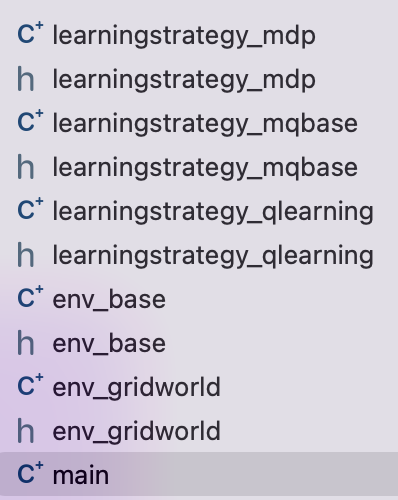
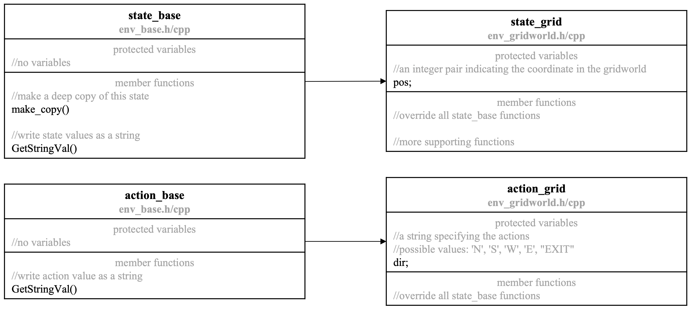
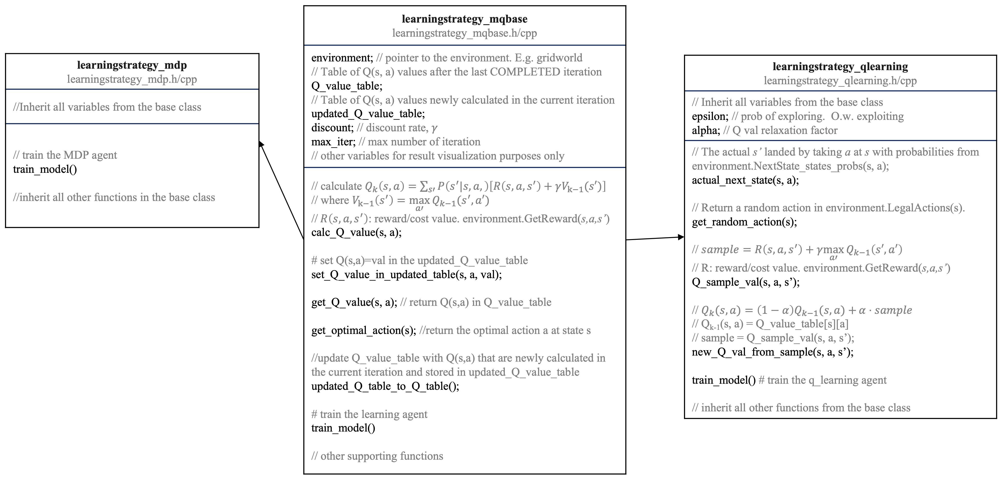
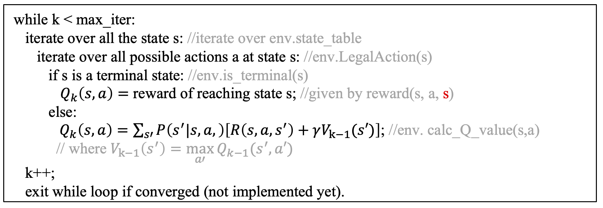

## 1 Introduction
To understand this specification and the program, readers are assumed to have the fundamental knowledge about MDP and Q-learning as well as the basic concept like V value, Q value, 𝛾 (discount rate), exploiting, exploring, etc. If not, it is highly recommended to take a look at Berkeley’s CS 188 course materials [1].

This document serves as a technical specification and user guidance for the C++ program. The complete script contains the files shown the figure below.  The program has a set of environments and a set of Learningstrategy.  The Learningstrategy, which can be markov decision process (MDP) agent or Q-learning agent in the current version, will look for the optimal scenarios in the environment under given circumstances. In principle, the program allows the users to implement their own environments as subclasses of the base environment class, env_base, upon their needs. These user-implemented environments should be compatible with the MDP and Q-learning agent as long as the  interface defined in env_base is followed. Details of these files and the overall architecture of the program will be covered in section 2.

## 2 Software Architecture
As stated in Section 1, in the program, the Learningstrategy will look for the optimal operation scenarios in the environment.

--- Environment ---
All the environments will be subclasses of the abstract base class defined in “env_base.h/cpp”.  env_base only defines the interface of the environment class, but the functions are not implemented (i.e. it is an abstract class). In principle, the Learningstrategies will be compatible with all environments following the interface defined in env_base (I.e. subclasses of env_base). As an example, env_gridworld implemented in “env_gridworld.h/cpp” is a subclass of env_base’s. The architecture is shown in the figure below.  Note that only the important functions are shown in the diagram for simplicity. Helper functions and debugging functions (e.g. functions to print Q values) are not shown.  Check the corresponding .h and .cpp files for more details.

--- State and Action ---
A state and an action should be defined for each environment. For example, a state in gridworld describes the coordinate and an action in gridworld describes the direction to go. For class function parameter compatibility, two base classes, state_base and action_base, are defined in env_state.h/cpp. The state and action of each environment should be defined as subclasses of state_base and action_base as shown in the figure below. Pointers of the base classes (action_base* and state_base*) are used as parameters and return types of any functions so as to be compatible with the program’s interface.

---	Learningstrategy classes and subclasses ---
Just like the environments, the Learningstrategies, so far the MDP agent implemented in “learningstrategy_mdp.h/cpp” and Q-learning agent in “learningstrategy_qlearning.h/cpp”, are defined as subclasses of a base class learningstrategy_mqbase implemented in “learningstrategy_mqbase.h/cpp”, which ensures that the interfaces of all these Learningstrategies are identical. Note that, unlike env_base, learningstrategy_mqbase is not a pure abstract class. Most of its functions are IMPLEMENTED because they are used in both the MDP agent and the Q-learning agent. I.e. learningstrategy_mqbase is not a standalone usable class, but it provides functions for the MDP agent and the Q-learning agent.

Their relationship diagram is shown in the figure below.  Note that only the important functions are shown in the diagram for simplicity.  Helper functions and debugging functions.  Check the corresponding .h/cpp files for more details.

Also note that environment is a variable in learningstrategy.  The optimal operation scenario will be found using the member function train_model(), which will be discussed shortly.

--- Markov Decision Process ---
Detailed mathematics and principles of MDP can be found in Berkeley’s CS 188 course materials [1].  This chapter will focus on its implementation in the program.  The pseudo code is shown in the figure below.  The Q value for each state and action is updated iteratively until converge.

In the Q value equation, 
$$ Q_k(s,a) $$

## 4 Bibliography

[1] 	UC Berkeley, "UC Berkeley CS188 Intro to AI -- Course Materials," [Online]. Available: http://ai.berkeley.edu/lecture_videos.html.
[2] 	Google Inc., "What is Colaboratory," [Online]. Available: https://colab.research.google.com/?utm_source=scs-index#scrollTo=5fCEDCU_qrC0.
[3] 	FMPy Group, "FMPy," [Online]. Available: https://fmpy.readthedocs.io/en/latest/.
[4] 	FMPy Group, "FMPy Tutorial," [Online]. Available: https://fmpy.readthedocs.io/en/latest/tutorial/.
